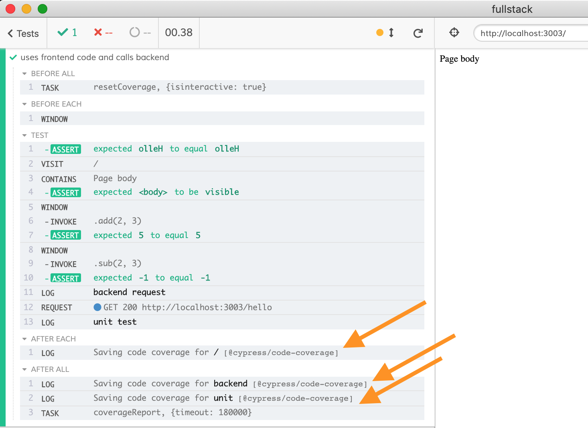

# example: fullstack

> Combined code coverage from the backend code, and e2e and unit tests

This example runs instrumented server code, that serves instrumented frontend code, and instruments the unit tests on the fly. The final report combines all 3 sources of information.

To run

```sh
$ npm run dev
```

You should see messages from the plugin when it saves each coverage object



In the produced report, you should see

- `server/server.js` coverage for backend
- `main.js` coverage from end-to-end tests
- `string-utils.js` coverage from unit tests
